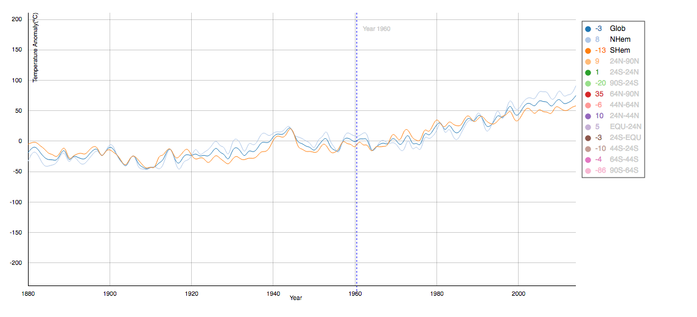
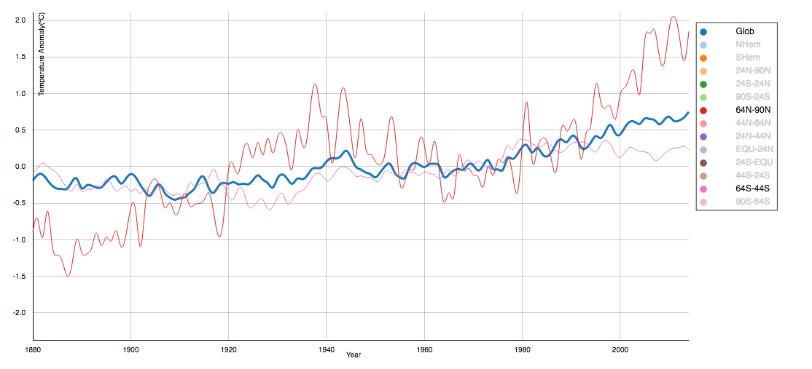
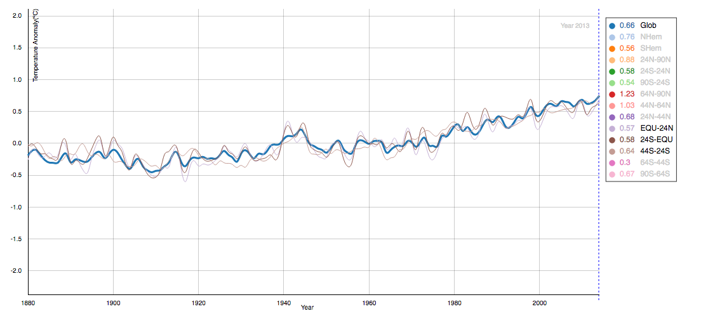
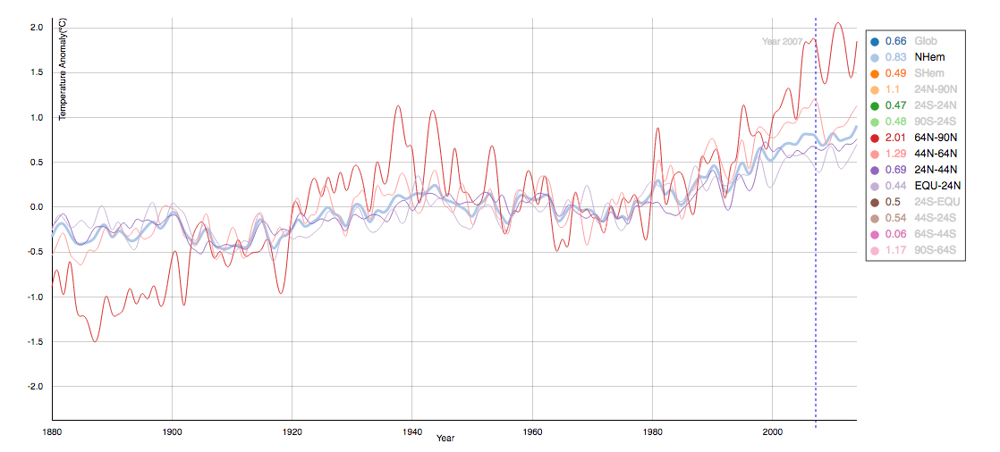
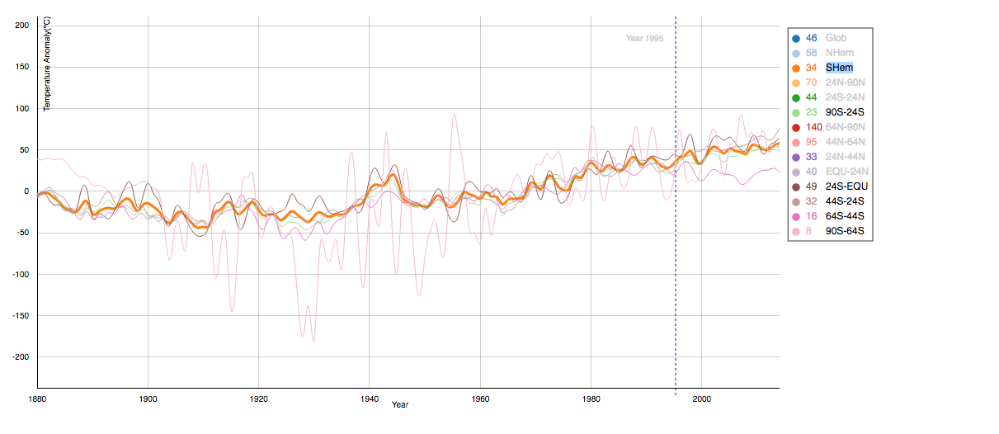

# data-visualization-week2-assignment
Data Visualization assignment Visualization of Numerical Data week 2

## GISTEMP data vizualization of the anual temperature means in zones troughout the years.

This graph is a representation of the GISTEMP data, showing annual temperature means (in celsius) for several zones trough the years.

The data is shown in a form of a multi line graph. The x-axes shows the timespan in years, while the y-axes show the mean of the annual temperature (in celsius) for the year of the plotted zone. Each zone is indicated by a unique color, which is described in the legenda on the right.

Initially the Global, northern- and southern hemisphere are shown. The user may select more zones to be shown.
The temperature is divided trough 100 to show it in celcius.

The legenda is made interactive.
- You can toggle the visibility of zones by data by clicking on the desired zone. This is useful to filter any data a user can be interested in.
- Hovering a zone will highlight the coresponding line.

The chart is made interactive:
- Move the mouse in the chart, the user will get an indication of the year the user is looking at. Also the mean temperature for the year will be shown in the legenda of all the zones.

Looking at the data there are a view conclusions to be made:

1. Both the Northern and Southern hemispheres switch having the highest average temperature several times. You can't say one of the two hemispheres is warmest. Tough the Northern hemisphere is probably the warmest on average.
2. The average temperature is rising slightly over all the years.
3. The temperatures on 24N-44N and 44S-24S are deviating the least of all zones.
4. Both the north and south poles are deviating the most. Especialilly in 2000-2014 and 1920-1960.
5. Looking at the measurements in 1880 and 2015, the north pole shows the highest temperature raise.
6. The temperature around the equator and 44S-24S deviate the least from the Global temperature.

### Known issues.

 - Filtering data in the legenda doesnt work when you click it the first time. You need to click it 3x...

### Screenshots

Global temperature, North- and South hemispheres

Temperature at the poles

Temperature around the equator

Tempreatures at the Northern hemisphere

Tempreatures at the Southern hemisphere
